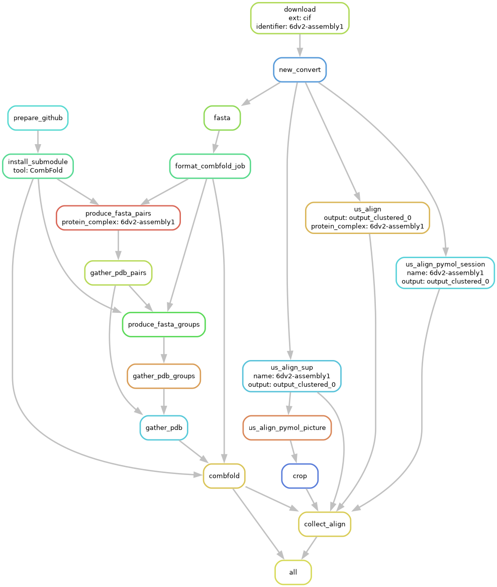

# Combfold benchmark

The pipeline downloads selected structures from the PDB, and produces their
Combfold predictions. These Combfold predictions are then aligned to
the known structure and the USalign TM score is reported. The Combfold
structures can be found in `results/data/`, and the TM scores in
`results/align`.

## Installation

The following commands install dependencies of the workflow in the _current_
directory within the `.pixi` folder. After installation, you cannot move the
folder without re-installling all the dependencies. If there is a problem with a
corrupted environment, you should remove the `.pixi` and the `.snakemake`
folders.

```bash
curl -fsSL https://pixi.sh/install.sh | bash
# ... cd <this repo>
pixi install
```

## Usage

Run `pixi run help` for the help page.

## Details


